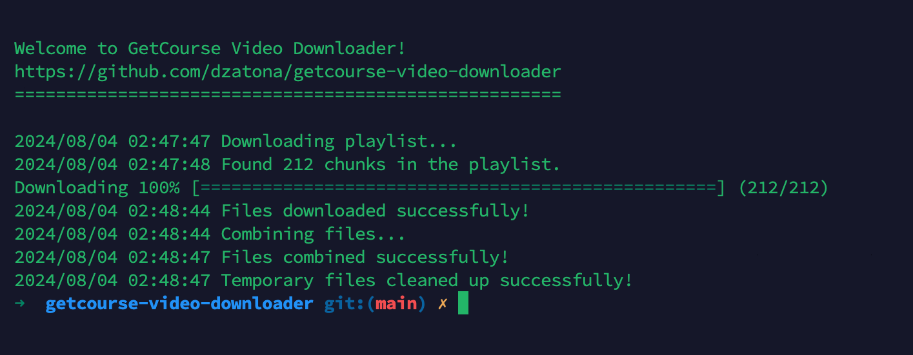
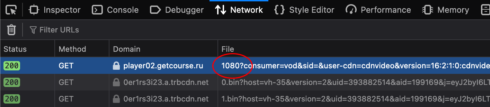

# Download GetCourse videos without transcoding

This software allows you to download HLS video streams from GetCourse without loss of quality, without the need for transcoding, and to merge them into a single video file. The program is written in Go language and is designed for use in Mac OS X operating system.  

The `bin` folder contains the compiled version.

## 0. Pre-requisites

**Software requires `ffmpeg` to work.**

### – Homebrew

If you do not have Homebrew installed, run the following commands in the terminal, otherwise skip this paragraph.

Run this command to install Homebrew:

`/bin/bash -c "$(curl -fsSL https://raw.githubusercontent.com/Homebrew/install/HEAD/install.sh)"`

### – FFmpeg

Then install FFmpeg using this command (terminal):

`brew install ffmpeg`

Then verify that the installation completed successfully:

`ffmpeg -version`

## 1. How to get a link to a video

* Open the page with the video in Chromium / Google Chrome browser.
* Right-click on the video, select "View Code".
* In the developer panel that opens, open the "Network" tab.
* Reload the page in your browser.
* Select the desired video resolution in the GetCourse video player settings.
* Start playing the video, let it play for a couple of seconds, then pause it.
* Find and copy the link ("Request URL") to the downloaded file with a number name that matches the resolution of the video in the player (360, 720, 1080, etc.).

## 2. Running the program 

### – If you're new

Simply download the program binary from the `bin` directory and run it with the following parameters:

`./getcourse-video-downloader <url> <file>`, where:

`url` — link to HLS video stream playlist

`file` — file name where the final video should be saved (video.mp4)

## Thanks to

The general logic is inspired by [mikhailnov](https://github.com/mikhailnov/getcourse-video-downloader), but his solution at the moment of publishing this readme has a significant problem with sound in clips after assembling them (obvious clicks at the beginning of each segment of the HLS video stream).

## Q?

Have any questions? [Create a new issue](https://github.com/dzatona/getcourse-video-downloader/issues/new/choose), I will try to help you.